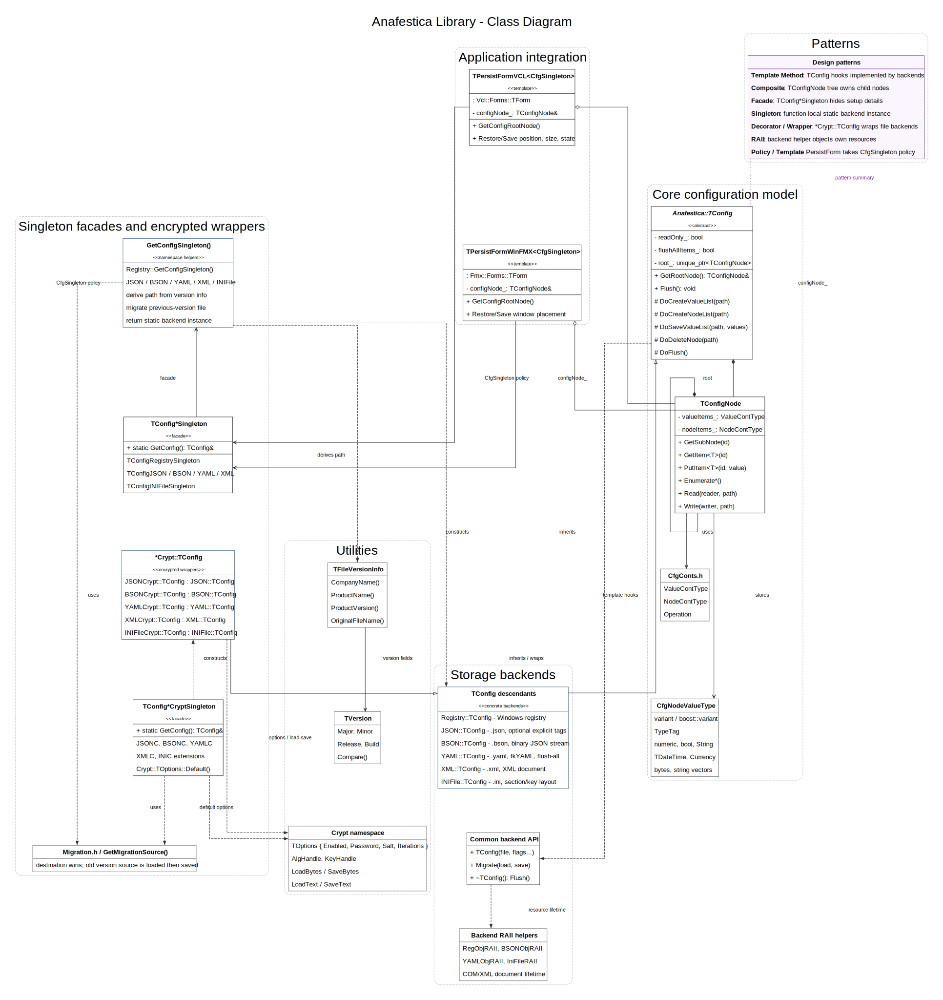

# Anafestica Library Documentation

## Overview

Anafestica is a header-only C++ library designed for the persistence of application settings in various storage media, including the Windows Registry, JSON files, XML files, and INI files. It provides a hierarchical, heterogeneous container that mimics the Windows Registry structure but operates in application memory, allowing seamless saving and loading of configuration data.

The library is particularly well-suited for GUI applications (FMX, VCL, and others) where it simplifies the management of persistent attributes such as form positions, sizes, states, and custom application settings. It requires minimal code changes to existing applications and supports multiple storage formats through a policy-based design.

## Key Features

- **Header-only library**: No compilation required, just include the necessary headers
- **Multiple storage backends**: Windows Registry, JSON files, XML files, INI files
- **Hierarchical data structure**: Tree-like organization similar to Windows Registry
- **Type-safe operations**: Supports various data types including primitives, strings, dates, and collections
- **Singleton pattern support**: Easy access through singleton classes
- **Form persistence helpers**: Specialized classes for VCL and FMX form persistence
- **Cross-platform compatibility**: Works with Embarcadero C++ compilers (bcc32c, bcc64, bcc64x)

## Architecture

The library consists of two main parts:

1. **Container Part**: A generalized hierarchical container (`TConfigNode`) that holds configuration data in memory
2. **Serialization Part**: Policy-based serializers that handle reading from and writing to different storage media

The container uses a tree structure where each node can contain:
- Named values of various types
- Named sub-nodes (child nodes)

The following class diagram illustrates the full architecture, including inheritance hierarchies, composition/aggregation relationships, and the design patterns used throughout the library (notation follows Gamma et al., *Design Patterns*, 1994):



## Core Classes

### TConfig (Abstract Base Class)

The base class for all configuration implementations. It provides the interface for configuration operations.

#### Public Interface

```cpp
class TConfig {
public:
    TConfig(bool ReadOnly, bool FlushAllItems);
    TConfigNode& GetRootNode();
    void Flush();
    ValueContType CreateValueList(TConfigPath const & Path);
    NodeContType CreateNodeList(TConfigPath const & Path);
    void SaveValueList(TConfigPath const & Path, ValueContType const & Values);
    void DeleteNode(TConfigPath const & Path);
    bool GetReadOnlyFlag() const noexcept;
    bool GetAlwaysFlushNodeFlag() const noexcept;
};
```

**Constructor Parameters:**

- `ReadOnly`: If true, prevents writing changes back to storage
- `FlushAllItems`: If true, flushes all items regardless of modification status

**Key Methods:**

- `GetRootNode()`: Returns the root configuration node
- `Flush()`: Writes all pending changes to storage
- `CreateValueList()`: Creates a list of values for a given path
- `CreateNodeList()`: Creates a list of sub-nodes for a given path
- `SaveValueList()`: Saves a list of values to a given path
- `DeleteNode()`: Deletes a node at the specified path

### TConfigNode

The main class representing a node in the configuration tree. Each node can contain values and sub-nodes.

#### Public Interface

```cpp
class TConfigNode {
public:
    TConfigNode();
    TConfigNode& GetSubNode(String Id);
    TConfigNode& operator[](String Id);

    // Value operations
    template<typename T>
    void GetItem(String Id, T& Val, Operation Op = Operation::None);

    template<typename T>
    T GetItem(String Id, Operation Op = Operation::None);

    template<typename T>
    bool PutItem(String Id, T&& Val, Operation Op = Operation::Write);

    // String list operations
    void GetItem(String Id, TStrings& Val, Operation Op = Operation::None);
    bool PutItem(String Id, TStrings& Val, Operation Op = Operation::Write);

    // Enumeration methods
    size_t GetNodeCount() const noexcept;
    size_t GetValueCount() const noexcept;

    template<typename OutputIterator>
    void EnumerateNodes(OutputIterator Output) const;

    template<typename OutputIterator>
    void EnumeratePairs(OutputIterator Out) const;

    template<typename OutputIterator>
    void EnumerateValueNames(OutputIterator Out) const;

    // Modification tracking
    bool IsDeleted() const noexcept;
    bool IsModified() const noexcept;

    // Node operations
    void DeleteItem(String Id);
    void DeleteSubNode(String Id);
    void Clear();
    bool ItemExists(String Id) const noexcept;
    bool SubNodeExists(String Id) const noexcept;
};
```

**Key Methods:**

**Node Navigation:**
- `GetSubNode(Id)`: Gets or creates a sub-node with the given ID
- `operator[](Id)`: Same as GetSubNode, allows array-like access

**Value Operations:**
- `GetItem(Id, Val)`: Retrieves a value, storing it in `Val`
- `PutItem(Id, Val)`: Stores a value
- `DeleteItem(Id)`: Marks a value for deletion

**Enumeration:**
- `EnumerateNodes()`: Lists all sub-node names. The `OutputIterator` receives `String` values representing the names of sub-nodes.
- `EnumerateValueNames()`: Lists all value names. The `OutputIterator` receives `String` values representing the names of stored values.
- `EnumeratePairs()`: Lists all name-value pairs. The `OutputIterator` receives `std::pair<String, ValueType>` elements, where `ValueType` is a variant that can hold any supported configuration value type (primitives, strings, dates, collections, etc.).

**Supported Data Types:**
The library supports the following data types through template specialization:

- `int`, `unsigned int`, `long`, `unsigned long`
- `char`, `unsigned char`, `short`, `unsigned short`
- `long long`, `unsigned long long`
- `bool`
- `String` (System::String — wide, UTF-16)
- `TDateTime`
- `float`, `double`, `Currency`
- `StringCont` (std::vector\<String\>)
- `TBytes`, `BytesCont` (std::vector\<Byte\>)
- `std::string` (narrow, treated as UTF-8; type tag `str`)
- `std::wstring` (wide UTF-16; type tag `wstr`)

**Convenience write overloads for string views:**
`std::string_view` and `std::wstring_view` are accepted by `PutItem` as a
write-path convenience. They are materialised to `std::string` / `std::wstring`
before being stored in the variant. Deserialization always returns owning
`std::string` / `std::wstring`, never a view (a view cannot own the data it
points to, so it cannot be safely stored in or returned from persistent storage).

**Special Handling for Enums:**
Enumerated types are automatically handled. If the enum has RTTI information, it's stored as a string; otherwise, as an integer.

### TFileVersionInfo

A utility class for extracting version information from the VERSIONINFO resource of a compiled executable. This class provides access to all standard version information fields that can be embedded in Windows executables through the VERSIONINFO resource.

#### Properties and Constructor

```cpp
class TFileVersionInfo {
public:
    explicit TFileVersionInfo(String FileName);
    
    __property String CompanyName = { read = GetCompanyName };
    __property String ProductName = { read = GetProductName };
    __property String ProductVersion = { read = GetProductVersion };
    __property String FileDescription = { read = GetFileDescription };
    __property String FileVersion = { read = GetFileVersion };
    __property String InternalName = { read = GetInternalName };
    __property String LegalCopyright = { read = GetLegalCopyright };
    __property String OriginalFilename = { read = GetOriginalFilename };
    __property String Comments = { read = GetComments };
};
```

**Constructor Parameters:**
- `FileName`: Path to the executable file containing VERSIONINFO resource

**Available Properties:**
- `CompanyName`: Company name from version info
- `ProductName`: Product name from version info
- `ProductVersion`: Product version string (e.g., "1.0.0.0")
- `FileDescription`: File description
- `FileVersion`: File version string
- `InternalName`: Internal name
- `LegalCopyright`: Copyright information
- `OriginalFilename`: Original filename
- `Comments`: Additional comments

**Example Usage:**

```cpp
#include <anafestica/FileVersionInfo.h>

using Anafestica::TFileVersionInfo;

// Get version info from current executable
String GetModuleFileName() {
    return ::GetModuleName(reinterpret_cast<NativeUInt>(HInstance));
}

void SetupApplicationCaption(TForm* Form) {
    TFileVersionInfo versionInfo{GetModuleFileName()};
    
    Form->Caption = Format(
        _T("%s, Version %s"),
        ARRAYOFCONST((
            versionInfo.ProductName,
            versionInfo.ProductVersion
        ))
    );
}

// Display version information in About dialog
void ShowVersionInfo() {
    TFileVersionInfo info{GetModuleFileName()};
    
    ShowMessage(
        Format(
            _T("Product: %s\nVersion: %s\nCompany: %s\nCopyright: %s"),
            ARRAYOFCONST((
                info.ProductName,
                info.ProductVersion,
                info.CompanyName,
                info.LegalCopyright
            ))
        )
    );
}
```

This class is commonly used to dynamically display version information in application captions, About dialogs, or for configuration purposes (as seen in the singleton classes that use version info to determine registry paths). The VERSIONINFO resource is typically set in your project's version information settings in the IDE.

## Concrete Implementations

### Registry::TConfig

Implements configuration storage in the Windows Registry.

```cpp
namespace Registry {
class TConfig : public Anafestica::TConfig {
public:
    TConfig(HKEY RootKey, String KeyPath, bool ReadOnly = false, bool FlushAllItems = false);
};
}
```

**Constructor Parameters:**
- `RootKey`: Registry root key (e.g., HKEY_CURRENT_USER)
- `KeyPath`: Path within the registry
- `ReadOnly`, `FlushAllItems`: Same as base class

**Data Type Handling:**  
The registry serializer maps configuration data types to native Windows Registry value types where possible. For data types that do not have direct registry equivalents (such as `unsigned int`, `long`, `char`, `bool`, `float`, `double`, `System::Currency`, `StringCont`, and `std::vector<Byte>`), type information is encoded into the registry key name using a colon-separated suffix syntax: `KeyName:(TypeTag)`. For example, an `unsigned int` value named "Count" would be stored under the registry key "Count:(u)". During reading, the serializer parses these encoded key names to reconstruct the correct data types. This approach ensures type safety while working within the constraints of the Windows Registry's native value types.

### JSON::TConfig

Implements configuration storage in JSON files.

```cpp
namespace JSON {
class TConfig : public Anafestica::TConfig {
public:
    TConfig(String FileName, bool ReadOnly = false, bool Compact = true,
            bool FlushAllItems = false, bool ExplicitTypes = false);
};
}
```

**Constructor Parameters:**
- `FileName`: Path to the JSON file
- `Compact`: If true, outputs compact JSON; if false, pretty-printed
- `ExplicitTypes`: If true, includes type information in JSON
- `ReadOnly`, `FlushAllItems`: Same as base class

### XML::TConfig

Implements configuration storage in XML files.

```cpp
namespace XML {
class TConfig : public Anafestica::TConfig {
public:
    TConfig(String FileName, bool ReadOnly = false, bool FlushAllItems = false);
};
}
```

**Constructor Parameters:**
- `FileName`: Path to the XML file
- `ReadOnly`, `FlushAllItems`: Same as base class

### INIFile::TConfig

Implements configuration storage in classic Windows INI files using `TMemIniFile`.

```cpp
namespace INIFile {
class TConfig : public Anafestica::TConfig {
public:
    TConfig(String FileName, bool ReadOnly = false, bool FlushAllItems = false);
};
}
```

**Constructor Parameters:**
- `FileName`: Path to the INI file (UTF-8 encoding)
- `ReadOnly`, `FlushAllItems`: Same as base class

**Storage layout:**  
The INI file is structured around sections and key/value pairs. The root node maps to the section `config`; nested paths are flattened into section names using a backslash separator, e.g. `config\Database\Primary`. Each value's key name encodes the type tag using the `Name::(TypeTag)` convention (e.g., `port::(i)=5432`, `host::(sz)=localhost`). This lets the serializer reconstruct the correct C++ type unambiguously when reading back, since all INI values are stored as plain text.

**Type encoding details:**
- Integer and floating-point types use their decimal representation.
- `bool` is stored as `1` or `0`.
- `TDateTime` is stored in ISO-8601 format.
- `StringCont` (vector\<String\>) is pipe-separated with `\` and `|` backslash-escaped.
- `TBytes` and `BytesCont` are Base64-encoded (same scheme as the XML/JSON backends).
- `std::string` is stored as UTF-8; `std::wstring` is stored as UTF-16 transcoded to UTF-8 in the file.
- The file itself is written in UTF-8 via `TEncoding::UTF8`.

## Singleton Classes

For convenience, the library provides singleton classes that automatically determine the registry path from the application's version information.

### TConfigRegistrySingleton

```cpp
class TConfigRegistrySingleton {
public:
    static Anafestica::TConfig& GetConfig();
};
```

This singleton creates a registry-based configuration using the path: `HKCU\Software\CompanyName\ProductName\ProductVersion`

The CompanyName, ProductName, and ProductVersion are read from the application's version info resource.

### TConfigJSONSingleton

```cpp
class TConfigJSONSingleton {
public:
    static Anafestica::TConfig& GetConfig();
};
```

This singleton creates a JSON-based configuration. The file path is derived from the application's version info: `$(HOME)\CompanyName\ProductName\ProductVersion\AppName.json`.

### TConfigXMLSingleton

```cpp
class TConfigXMLSingleton {
public:
    static Anafestica::TConfig& GetConfig();
};
```

This singleton creates an XML-based configuration. The file path is derived from the application's version info: `$(HOME)\CompanyName\ProductName\ProductVersion\AppName.xml`.

### TConfigINIFileSingleton

```cpp
class TConfigINIFileSingleton {
public:
    static Anafestica::TConfig& GetConfig();
};
```

This singleton creates an INI-file-based configuration. The file path is derived from the application's version info: `$(HOME)\CompanyName\ProductName\ProductVersion\AppName.ini`.

Include `<anafestica/CfgIniFileSingleton.h>` to use this singleton.

## Form Persistence Classes

### TPersistFormVCL

A VCL form class that automatically persists form position, size, and state.

```cpp
template<typename CfgSingleton>
class TPersistFormVCL : public Vcl::Forms::TForm {
public:
    enum class StoreOpts {
        None, OnlySize, OnlyPos, PosAndSize,
        OnlyState, StateAndSize, StateAndPos, All
    };

    TPersistFormVCL(TComponent* Owner, StoreOpts StoreOptions = StoreOpts::All,
                   TConfigNode* RootNode = nullptr);
    TConfigNode& GetConfigNode() const;
    static TConfigNode& GetConfigRootNode();
    void ReadValues();
    void SaveValues();
};
```

**StoreOpts Enumeration:**
- `None`: No persistence
- `OnlySize`: Persist width and height
- `OnlyPos`: Persist left and top position
- `PosAndSize`: Persist position and size
- `OnlyState`: Persist window state (minimized/maximized)
- `StateAndSize`: Persist state and size
- `StateAndPos`: Persist state and position
- `All`: Persist everything

### TPersistFormFMX

Similar to TPersistFormVCL but for FireMonkey (FMX) forms.

```cpp
template<typename CfgSingleton>
class TPersistFormFMX : public Fmx::Forms::TForm {
    // Similar interface to TPersistFormVCL
};
```

## Persistence Macros

The library provides convenience macros for persisting properties and values. These macros are defined in `CfgItems.h` (general-purpose) and `PersistFormVCL.h`/`PersistFormFMX.h` (form-specific).

### RESTORE_LOCAL_PROPERTY(PROPERTY)

```cpp
#define RESTORE_LOCAL_PROPERTY( PROPERTY ) \
{ \
    std::remove_reference_t< decltype( PROPERTY )> Tmp{ PROPERTY }; \
    GetConfigNode().GetItem( #PROPERTY, Tmp ); \
    PROPERTY = Tmp; \
}
```

**Description:**  
Restores a property value from the configuration storage. The macro creates a temporary variable of the same type as the property, reads the value from the configuration using the property name as the key, and assigns it back to the property. This provides safe restoration with default value fallback.

**Parameters:**
- `PROPERTY`: The property variable to restore

**Example:**
```cpp
// In a form class that inherits from TPersistFormVCL
RESTORE_LOCAL_PROPERTY(FontSize);  // Restores FontSize from config
```

### SAVE_LOCAL_PROPERTY(PROPERTY)

```cpp
#define SAVE_LOCAL_PROPERTY( PROPERTY ) \
    GetConfigNode().PutItem( #PROPERTY, PROPERTY )
```

**Description:**  
Saves a property value to the configuration storage. The macro uses the property name as the configuration key and stores the current property value.

**Parameters:**
- `PROPERTY`: The property variable to save

**Example:**
```cpp
// In a form class that inherits from TPersistFormVCL
SAVE_LOCAL_PROPERTY(FontSize);  // Saves FontSize to config
```

**Note:** These macros automatically use the property name as the configuration key, making the code more readable and less error-prone than manually specifying string keys.

### RESTORE_PROPERTY(NODE, PROPERTY)

```cpp
#define RESTORE_PROPERTY( NODE, PROPERTY ) \
{ \
    std::remove_reference_t< decltype( PROPERTY )> Tmp{ PROPERTY }; \
    ( NODE ).GetItem( #PROPERTY, Tmp ); \
    PROPERTY = Tmp; \
}
```

**Description:**  
Restores a property value from a specified configuration node. The macro creates a temporary variable of the same type as the property, reads the value from the configuration node using the property name as the key, and assigns it back to the property. This provides safe restoration with default value fallback.

**Parameters:**
- `NODE`: The TConfigNode reference to read from
- `PROPERTY`: The property variable to restore

**Example:**
```cpp
auto& configNode = config.GetRootNode();
int fontSize = 12;  // Default value
RESTORE_PROPERTY(configNode, fontSize);  // Restores fontSize from config
```

### SAVE_PROPERTY(NODE, PROPERTY)

```cpp
#define SAVE_PROPERTY( NODE, PROPERTY ) \
    ( NODE ).PutItem( #PROPERTY, PROPERTY )
```

**Description:**  
Saves a property value to a specified configuration node. The macro uses the property name as the configuration key and stores the current property value.

**Parameters:**
- `NODE`: The TConfigNode reference to write to
- `PROPERTY`: The property variable to save

**Example:**
```cpp
auto& configNode = config.GetRootNode();
int fontSize = 14;
SAVE_PROPERTY(configNode, fontSize);  // Saves fontSize to config
```

### RESTORE_ID_PROPERTY(NODE, ID, PROPERTY)

```cpp
#define RESTORE_ID_PROPERTY( NODE, ID, PROPERTY ) \
{ \
    std::remove_reference_t< decltype( PROPERTY )> Tmp{ PROPERTY }; \
    ( NODE ).GetItem( #ID, Tmp ); \
    PROPERTY = Tmp; \
}
```

**Description:**  
Restores a property value from a specified configuration node using a custom identifier. Unlike `RESTORE_PROPERTY`, this macro allows you to specify a custom key name instead of using the property name. The macro creates a temporary variable of the same type as the property, reads the value from the configuration node using the specified ID as the key, and assigns it back to the property.

**Parameters:**
- `NODE`: The TConfigNode reference to read from
- `ID`: The custom identifier/key to use for storage
- `PROPERTY`: The property variable to restore

**Example:**
```cpp
auto& configNode = config.GetRootNode();
int fontSize = 12;  // Default value
RESTORE_ID_PROPERTY(configNode, "FontSize", fontSize);  // Restores using custom key
```

### SAVE_ID_PROPERTY(NODE, ID, PROPERTY)

```cpp
#define SAVE_ID_PROPERTY( NODE, ID, PROPERTY ) \
    ( NODE ).PutItem( #ID, PROPERTY )
```

**Description:**  
Saves a property value to a specified configuration node using a custom identifier. Unlike `SAVE_PROPERTY`, this macro allows you to specify a custom key name instead of using the property name.

**Parameters:**
- `NODE`: The TConfigNode reference to write to
- `ID`: The custom identifier/key to use for storage
- `PROPERTY`: The property variable to save

**Example:**
```cpp
auto& configNode = config.GetRootNode();
int fontSize = 14;
SAVE_ID_PROPERTY(configNode, "FontSize", fontSize);  // Saves using custom key
```

**Note:** The `*_ID_*` variants are useful when you need to use a different key name than the property name, or when working with properties that don't have meaningful names for storage purposes.

**Macro Categories:**
- **Local macros** (`RESTORE_LOCAL_PROPERTY`, `SAVE_LOCAL_PROPERTY`): Designed for use within form classes that inherit from `TPersistFormVCL` or `TPersistFormFMX`. They automatically use `GetConfigNode()` to access the form's configuration node.
- **General macros** (`RESTORE_PROPERTY`, `SAVE_PROPERTY`, `RESTORE_ID_PROPERTY`, `SAVE_ID_PROPERTY`): Can be used with any `TConfigNode` reference, providing flexibility for custom configuration scenarios.

## Usage Examples

### Basic Usage with Registry

```cpp
#include <anafestica/CfgRegistrySingleton.h>

// Get the singleton configuration
auto& config = Anafestica::TConfigRegistrySingleton::GetConfig();
auto& root = config.GetRootNode();

// Store a value
root.PutItem(_D("Setting1"), 42);
root.PutItem(_D("Setting2"), _D("Hello World"));

// Retrieve a value
int value = root.GetItem<int>(_D("Setting1"));

// Flush changes to registry
config.Flush();
```

### Using Sub-nodes

```cpp
// Create a sub-node
auto& subNode = root[_D("UserPreferences")];

// Store values in sub-node
subNode.PutItem(_D("Theme"), _D("Dark"));
subNode.PutItem(_D("FontSize"), 12);

// Access sub-node
String theme = root[_D("UserPreferences")].GetItem<String>(_D("Theme"));
```

### Form Persistence

```cpp
// In form header
class TMyForm : public Anafestica::TPersistFormVCL<Anafestica::TConfigRegistrySingleton> {
    // Form inherits persistence automatically
};

// In form implementation
TMyForm::TMyForm(TComponent* Owner)
    : TPersistFormVCL(Owner, StoreOpts::All)  // Persist position, size, and state
{
    // Additional initialization
}
```

### JSON Configuration

```cpp
#include <anafestica/CfgJSON.h>

Anafestica::JSON::TConfig config(_D("settings.json"));
auto& root = config.GetRootNode();

root.PutItem(_D("AppName"), _D("MyApplication"));
root.PutItem(_D("Version"), _D("1.0"));

// Configuration is automatically saved on destruction
```

### INI File Configuration

```cpp
#include <anafestica/CfgIniFile.h>

Anafestica::INIFile::TConfig config(_D("settings.ini"));
auto& root = config.GetRootNode();

root.PutItem(_D("AppName"), _D("MyApplication"));
root.PutItem(_D("Port"), 5432);

// Configuration is automatically saved on destruction
```

The resulting INI file will look like:

```ini
[config]
AppName::(sz)=MyApplication
Port::(i)=5432
```

### Using Collection Data Types

The library supports storing collections of strings and bytes. `StringCont` (defined as `std::vector<String>`) stores multiple strings and maps to `REG_MULTI_SZ` in the Windows Registry. `BytesCont` (defined as `std::vector<Byte>`) stores binary data.

```cpp
#include <anafestica/CfgRegistrySingleton.h>

// Get the singleton configuration
auto& config = Anafestica::TConfigRegistrySingleton::GetConfig();
auto& root = config.GetRootNode();

// Store a collection of strings (maps to REG_MULTI_SZ in registry)
StringCont recentFiles = { _D("file1.txt"), _D("file2.txt"), _D("file3.txt") };
root.PutItem(_D("RecentFiles"), recentFiles);

// Store binary data
BytesCont binaryData = { 0x01, 0x02, 0x03, 0x04 };
root.PutItem(_D("BinaryBlob"), binaryData);

// Retrieve the collections
StringCont loadedFiles = root.GetItem<StringCont>(_D("RecentFiles"));
BytesCont loadedData = root.GetItem<BytesCont>(_D("BinaryBlob"));

// Flush changes to registry
config.Flush();
```

### Working with TStrings-based Controls (TMemo)

The library provides specialized overloads of `GetItem` and `PutItem` that work directly with `TStrings` descendants (such as `TMemo::Lines`). These methods automatically convert between `TStrings` and the internal `StringCont` representation, making it convenient to persist multi-line text controls.

```cpp
#include <anafestica/CfgRegistrySingleton.h>
#include <vcl.h>

// Example: Saving and restoring TMemo lines
class TMyForm : public TForm {
private:
    TMemo* Memo1;
    
public:
    void SaveMemoContent() {
        auto& config = Anafestica::TConfigRegistrySingleton::GetConfig();
        auto& root = config.GetRootNode();
        
        // Save TMemo lines directly using the reference overload
        root.PutItem(_D("MemoLines"), Memo1->Lines);
        
        // Flush changes to registry (maps to REG_MULTI_SZ in Windows Registry)
        config.Flush();
    }
    
    void RestoreMemoContent() {
        auto& config = Anafestica::TConfigRegistrySingleton::GetConfig();
        auto& root = config.GetRootNode();
        
        // Restore TMemo lines directly using the reference overload
        // If the key doesn't exist or operation fails, Memo1->Lines remains unchanged
        root.GetItem(_D("MemoLines"), Memo1->Lines);
    }
};
```

The four `TStrings` specialized methods are:
- `void GetItem(String Id, TStrings& Val, Operation Op = Operation::None)` – Retrieve lines by reference
- `void GetItem(String Id, TStrings* const Val, Operation Op = Operation::None)` – Retrieve lines by pointer
- `bool PutItem(String Id, TStrings& Val, Operation Op = Operation::Write)` – Store lines by reference
- `bool PutItem(String Id, TStrings* const Val, Operation Op = Operation::Write)` – Store lines by pointer

Both pointer and reference overloads provide the same functionality; choose based on your coding style. The library internally converts between `TStrings` and `StringCont` (a `std::vector<String>`), allowing seamless integration with VCL controls.

### Service Application Configuration Example

Here is a real-world example showing how to use `TConfigJSON` to manage complex hierarchical configurations for a service application. This pattern demonstrates how to organize nested settings groups, track modifications, and persist configuration to JSON files.

**Header File (ServiceConfig.h):**

```cpp
#ifndef ServiceConfigH
#define ServiceConfigH

#include <anafestica/CfgItems.h>
#include <memory>

namespace ServiceApp::Config {

// Change tracking utility
template<typename T>
class ConfigValue {
public:
    ConfigValue() = default;
    ConfigValue(Anafestica::TConfigNode& Node, String KeyName, T DefaultValue)
        : value_(DefaultValue), oldValue_(DefaultValue) {
        try {
            Node.GetItem(KeyName, value_);
        } catch (...) {
            // Use default if key doesn't exist
        }
        oldValue_ = value_;
    }
    
    T Get() const noexcept { return value_; }
    void Set(T Val) noexcept { value_ = Val; }
    bool IsModified() const noexcept { return value_ != oldValue_; }
    void SetUnmodified() noexcept { oldValue_ = value_; }
    
private:
    T value_{};
    T oldValue_{};
};

// Database Configuration
class DatabaseSettings {
public:
    DatabaseSettings() = default;
    DatabaseSettings(Anafestica::TConfigNode& Cfg) 
        : server_(Cfg, _D("Server"), _D("localhost"))
        , port_(Cfg, _D("Port"), 5432)
        , database_(Cfg, _D("Database"), _D("myapp"))
        , username_(Cfg, _D("Username"), _D("admin"))
    {
    }
    
    void SaveTo(Anafestica::TConfigNode& Cfg) {
        Cfg.PutItem(_D("Server"), server_.Get());
        Cfg.PutItem(_D("Port"), port_.Get());
        Cfg.PutItem(_D("Database"), database_.Get());
        Cfg.PutItem(_D("Username"), username_.Get());
    }
    
    String GetServer() const noexcept { return server_.Get(); }
    void SetServer(String Val) noexcept { server_.Set(Val); }
    
    int GetPort() const noexcept { return port_.Get(); }
    void SetPort(int Val) noexcept { port_.Set(Val); }
    
    String GetDatabase() const noexcept { return database_.Get(); }
    void SetDatabase(String Val) noexcept { database_.Set(Val); }
    
    String GetUsername() const noexcept { return username_.Get(); }
    void SetUsername(String Val) noexcept { username_.Set(Val); }
    
    bool IsModified() const noexcept {
        return server_.IsModified() || port_.IsModified() 
            || database_.IsModified() || username_.IsModified();
    }
    
    void SetUnmodified() {
        server_.SetUnmodified();
        port_.SetUnmodified();
        database_.SetUnmodified();
        username_.SetUnmodified();
    }
    
private:
    ConfigValue<String> server_;
    ConfigValue<int> port_;
    ConfigValue<String> database_;
    ConfigValue<String> username_;
};

// Logging Configuration
class LoggingSettings {
public:
    LoggingSettings() = default;
    LoggingSettings(Anafestica::TConfigNode& Cfg)
        : enabled_(Cfg, _D("Enabled"), true)
        , logLevel_(Cfg, _D("LogLevel"), _D("Info"))
        , maxFileSize_(Cfg, _D("MaxFileSize"), 10485760)  // 10 MB
    {
    }
    
    void SaveTo(Anafestica::TConfigNode& Cfg) {
        Cfg.PutItem(_D("Enabled"), enabled_.Get());
        Cfg.PutItem(_D("LogLevel"), logLevel_.Get());
        Cfg.PutItem(_D("MaxFileSize"), maxFileSize_.Get());
    }
    
    bool GetEnabled() const noexcept { return enabled_.Get(); }
    void SetEnabled(bool Val) noexcept { enabled_.Set(Val); }
    
    String GetLogLevel() const noexcept { return logLevel_.Get(); }
    void SetLogLevel(String Val) noexcept { logLevel_.Set(Val); }
    
    int GetMaxFileSize() const noexcept { return maxFileSize_.Get(); }
    void SetMaxFileSize(int Val) noexcept { maxFileSize_.Set(Val); }
    
    bool IsModified() const noexcept {
        return enabled_.IsModified() || logLevel_.IsModified() 
            || maxFileSize_.IsModified();
    }
    
    void SetUnmodified() {
        enabled_.SetUnmodified();
        logLevel_.SetUnmodified();
        maxFileSize_.SetUnmodified();
    }
    
private:
    ConfigValue<bool> enabled_;
    ConfigValue<String> logLevel_;
    ConfigValue<int> maxFileSize_;
};

// Main Service Settings
class Settings {
public:
    Settings() = default;
    
    Settings(Anafestica::TConfigNode& Cfg)
        : database_(Cfg.GetSubNode(_D("Database")))
        , logging_(Cfg.GetSubNode(_D("Logging")))
    {
    }
    
    void LoadFrom(Anafestica::TConfigNode& Cfg) {
        database_ = DatabaseSettings(Cfg.GetSubNode(_D("Database")));
        logging_ = LoggingSettings(Cfg.GetSubNode(_D("Logging")));
    }
    
    void SaveTo(Anafestica::TConfigNode& Cfg) {
        database_.SaveTo(Cfg.GetSubNode(_D("Database")));
        logging_.SaveTo(Cfg.GetSubNode(_D("Logging")));
    }
    
    DatabaseSettings& GetDatabase() noexcept { return database_; }
    DatabaseSettings const& GetDatabase() const noexcept { return database_; }
    
    LoggingSettings& GetLogging() noexcept { return logging_; }
    LoggingSettings const& GetLogging() const noexcept { return logging_; }
    
    bool IsModified() const noexcept {
        return database_.IsModified() || logging_.IsModified();
    }
    
    void SetUnmodified() {
        database_.SetUnmodified();
        logging_.SetUnmodified();
    }
    
private:
    DatabaseSettings database_;
    LoggingSettings logging_;
};

}  // End of namespace ServiceApp::Config

#endif
```

**Implementation Example (Service Main Code):**

```cpp
#include <anafestica/CfgJSON.h>
#include "ServiceConfig.h"

using Anafestica::JSON::TConfig;

class ServiceApplication {
private:
    std::unique_ptr<TConfig> config_;
    ServiceApp::Config::Settings settings_;
    
public:
    ServiceApplication(String ConfigFileName) {
        // Load configuration from JSON file (read-only initially)
        config_ = std::make_unique<TConfig>(ConfigFileName, true);  // true = read-only
        auto& root = config_->GetRootNode();
        settings_ = ServiceApp::Config::Settings(root);
    }
    
    void SaveConfiguration() {
        if (settings_.IsModified()) {
            // Create a new writable config instance to save changes
            TConfig writableConfig(config file path, false);  // false = read-write
            settings_.SaveTo(writableConfig.GetRootNode());
            writableConfig.Flush();  // Write to file
            
            // Mark all settings as unmodified
            settings_.SetUnmodified();
        }
    }
    
    void ConfigureDatabase(String Server, int Port, String Database, String User) {
        auto& dbSettings = settings_.GetDatabase();
        dbSettings.SetServer(Server);
        dbSettings.SetPort(Port);
        dbSettings.SetDatabase(Database);
        dbSettings.SetUsername(User);
    }
    
    void ConfigureLogging(bool Enabled, String LogLevel, int MaxSize) {
        auto& logSettings = settings_.GetLogging();
        logSettings.SetEnabled(Enabled);
        logSettings.SetLogLevel(LogLevel);
        logSettings.SetMaxFileSize(MaxSize);
    }
    
    String GetDatabaseServer() const {
        return settings_.GetDatabase().GetServer();
    }
    
    bool HasPendingChanges() const {
        return settings_.IsModified();
    }
};

// Usage in application entry point
int main() {
    try {
        ServiceApplication app(_D("C:\\ProgramData\\MyService\\Config.json"));
        
        // Modify configuration as needed
        app.ConfigureDatabase(
            _D("db.example.com"), 5432, _D("production"), _D("svc_user")
        );
        app.ConfigureLogging(true, _D("Debug"), 50 * 1024 * 1024);  // 50 MB
        
        // Save only if changes were made
        if (app.HasPendingChanges()) {
            app.SaveConfiguration();
        }
        
        // Use configuration...
        String server = app.GetDatabaseServer();
        
    } catch (Exception& E) {
        MessageBox(NULL, E.Message.c_str(), _D("Error"), MB_OK | MB_ICONERROR);
        return 1;
    }
    
    return 0;
}
```

**Generated JSON File Structure:**

```json
{
  "Database": {
    "Server": "db.example.com",
    "Port": 5432,
    "Database": "production",
    "Username": "svc_user"
  },
  "Logging": {
    "Enabled": true,
    "LogLevel": "Debug",
    "MaxFileSize": 52428800
  }
}
```

This pattern demonstrates:
- **Hierarchical organization**: Settings grouped into logical sections using sub-nodes
- **Change tracking**: Each setting tracks its original value for detecting modifications
- **Default values**: Fallback defaults if configuration keys don't exist
- **Nested objects**: `Settings` class manages multiple configuration groups
- **Atomic saves**: Only write to file when there are actual changes
- **Type safety**: Strongly-typed configuration properties

## Dependencies

- **Boost Libraries**: Required for `boost::variant` when using `bcc32c` or `bcc64` compilers (unless `ANAFESTICA_USE_STD_VARIANT` is defined). The `bcc64x` compiler (which uses Clang 20) supports `std::variant` properly, so you can optionally use standard library variants by defining `ANAFESTICA_USE_STD_VARIANT` as a project-wide preprocessor definition when using this compiler.
- **Embarcadero C++ Compiler**: Only clang-based compilers (bcc32c, bcc64, bcc64x) are supported
- **RAD Studio**: Compatible with RAD Studio 10.3+ (earlier versions may work but are untested)

## Installation

1. Clone or download the library headers
2. Add the library path to your project's include directories
3. For Registry usage, ensure your project has proper version info set (CompanyName, ProductName, ProductVersion)
4. Install Boost libraries via GetIt or manually

## Thread Safety

The library is not thread-safe. Access to configuration objects should be serialized if used from multiple threads.

## Error Handling

The library uses exceptions for error conditions:
- Registry access errors throw `ERegistryException`
- File I/O errors throw standard C++ exceptions
- JSON/XML parsing errors throw appropriate parser exceptions

## Best Practices

1. Use singletons for application-wide configuration
2. Group related settings in sub-nodes
3. Use meaningful names for configuration keys
4. Call `Flush()` explicitly or rely on destructor for automatic saving
5. Handle exceptions appropriately in production code
6. Use properties with persistence macros for cleaner code (as shown in examples)
7. Use the `_D()` macro around string literals for proper Unicode support in Embarcadero C++
8. **For Clang-based compilers (bcc32c, bcc64, bcc64x)**: Add form cleanup code in your project's main application file to ensure proper destruction order. Since the library uses singletons for serialization, you must manually destroy all forms before the application terminates to prevent access to destroyed singletons. Add the following code after `Application->Run()`:

   ```cpp
   while (auto const Cnt = Screen->FormCount) {
       delete Screen->Forms[Cnt - 1];
   }
   ```

   This ensures that form objects (which may hold references to configuration singletons) are properly destroyed before the singletons themselves are cleaned up by the runtime.

   Example: 
   
   ```cpp
   int WINAPI _tWinMain(HINSTANCE, HINSTANCE, LPTSTR, int)
   {
       try
       {
           Application->Initialize();
           Application->MainFormOnTaskBar = true;
           Application->CreateForm(__classid(TForm1), &Form1);
           Application->Run();
           while ( auto const Cnt = Screen->FormCount ) {
               delete Screen->Forms[Cnt - 1];
           }
       }
       catch (Exception &exception) {
           Application->ShowException(&exception);
       }
       catch (...)
       {
           try {
               throw Exception("");
           }
           catch (Exception &exception) {
               Application->ShowException(&exception);
           }
       }
       return 0;
   }
   ```

## Limitations

- Limited to Embarcadero C++ compilers
- Windows Registry support is Windows-only
- No built-in encryption or security features
- No concurrent access protection (it's not thread safe)
