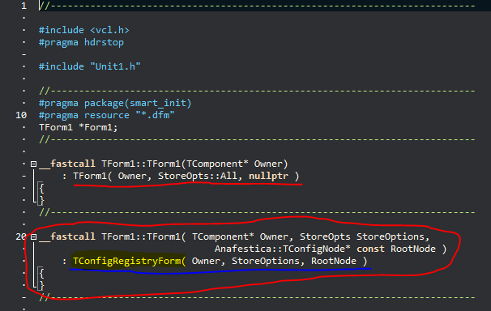
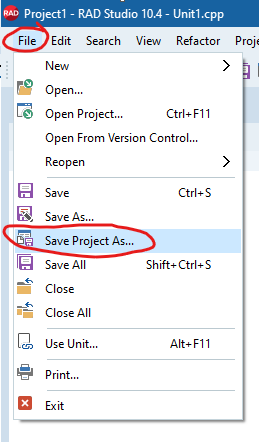

# Quick tour

Suppose the goal is to create a small application consisting of a single form. The application must be able to save the position, size, and state of the form along with an additional attribute. To make sense of this "journey" into the library, let's try writing a small clock gadget. This gadget must allow (and remember) the selection of the font used to show the time. Also, even the form position, the size, and the state have to be stored. 

Here's how it could be the form layout:


The application is conceptually simple. Alas, obtaining the persistence of the form and the custom attributes, "by hand", is not so simple: it requires writing a fair amount of code. On the other hand, using the Anafestica library greatly simplify the process: in short, it only takes a few lines of code to save a form in the Windows registry, as it's possible to see below:




The whole story is a little longer, and the meaning of those lines of code will be revealed shortly, but it's immediately possible to note that the amount of additional code is minimal.

As this application uses the Windows Registry, a question immediately comes to mind: where are the attributes of the form stored? In particular, which place in the Windows Registry? 

The answer is easy. In the most obvious place: in the `HKCU\Software\Vendor\Product\Version\FormName\` registry key.

The *FormName* part is taken from the `Name` property of the `Form1` object, but where the *Vendor*, *Product*, and *Version* parts come from? How does the library user set these values? The answer is simple: from the project's version info keys. Namely:


So, the position, size, and the state for the Form1 are stored in `HKCU\Software\TestCompany\TestAnafestica\1.0\Form1\`:


Since the library, usually, uses one or more singletons for the serialization process, the other few lines of code (to be added only once), are used to ensure that the application forms are destroyed before the singletons gone. To ensure correct behavior, you need to add a few lines the project source file, as in the following snippet:


To manage custom attributes is better to use properties. It is not strictly necessary to use properties, but using them makes the code more readable. Properties are very handful when used along with some library macro. However, it's possible to have more granular control over the persistence process, by calling the library classes' methods directly instead of using the aforementioned macros, but the macros use makes life smoother.

> *Before continuing, it is better to know that all the steps described here can be skipped by loading one of the reference applications in the [App](Appl) folder (then saving them as a copy in a different place) or saving a prototype of "typical application" in the IDE's object repository for subsequent use, so you don't have to repeat the next steps for each new project.*

In this GitHub repository there's [the clock gadget example](Demo/VCLSimpleDemo) that will be replicated in the following steps. As it uses properties along with macros, it is one of the simplest scenarios for the management of persistent attributes.

Now let's see how to build it from scratch.

Create a new VCL application for C++ Builder: 


Next, add the 64-bit platform for Windows:


Now make some essential "adjustments" to the project. From the Project->Options menu (Shift + Ctrl + F11):

Turn off the "classic C++ compiler" (it's better to do it for all the platforms):


Set the appropriate values for *CompanyName*, *ProductName*, and *ProductVersion* in the version info keys for all platforms. 


> *Note: if you skip the previous step, when you start the application it will give you a "resource not found error". The application needs these values because it uses them to access the `HKCU\CompanyName\ProductName\ProductVersion` path in the Windows Registry.*

Let's save the project.



Now **close** the project.

Why it's necessary to close the project? Because the template project contained in the IDE and used to initially create this application, as it is, doesn't propagate the settings you made so far on all the platforms and their associated configurations. So now, with a simple text editor, it's possible to remove the problematic lines inside the project file (.cbproj).

Create a backup copy of the main project file (.cbproj). Then open the original file in an editor:


Now, edit the file: hence, remove all `<VerInfo_Keys>` tags from all nodes except the first one, which is usually `<PropertyGroup Condition = "'$ (Base)'! = ''">`:


Save the modified project file, then reopen it in the IDE. If you have problems, take the backup copy and try again.

Now, let's reduce the size of the main form a bit: for example, with the Width property set to 340 and the Height property to 200. 

Next, copy into the clipboard the following snippet, then paste it into the main form (right-click on the form then select Edit -> Paste from the context menu). This creates the necessary components without needs to drag them from the IDE's component palette:

```dfm
object lblClock: TLabel
  Left = 0
  Top = 56
  Width = 324
  Height = 105
  Align = alBottom
  Alignment = taCenter
  Anchors = [akLeft, akTop, akRight, akBottom]
  AutoSize = False
  Caption = '--:--:--'
  Font.Charset = DEFAULT_CHARSET
  Font.Color = clWindowText
  Font.Height = -53
  Font.Name = 'Tahoma'
  Font.Style = []
  ParentFont = False
  Layout = tlCenter
  ExplicitWidth = 331
  ExplicitHeight = 184
end
object comboboxFontName: TComboBox
  Left = 24
  Top = 24
  Width = 145
  Height = 21
  Style = csDropDownList
  TabOrder = 0
end
object Label1: TLabel
  Left = 24
  Top = 8
  Width = 52
  Height = 13
  Caption = 'Font Name'
end
object Timer1: TTimer
  Left = 224
  Top = 24
end
```

Now the main form should look like:


At this point, modify the Unit1.h file (the header file of the main form) as the following (you can copy and paste these lines directly in the code editor for the Unit1.h file):

```cpp
//---------------------------------------------------------------------------

#ifndef Unit1H
#define Unit1H

//---------------------------------------------------------------------------

#include <System.Classes.hpp>
#include <Vcl.Controls.hpp>
#include <Vcl.ExtCtrls.hpp>
#include <Vcl.StdCtrls.hpp>

#include <anafestica/PersistFormVCL.h>
#include <anafestica/CfgRegistrySingleton.h>

//---------------------------------------------------------------------------

using TConfigRegistryForm =
    Anafestica::TPersistFormVCL<Anafestica::TConfigRegistrySingleton>;

//---------------------------------------------------------------------------

class TForm1 : public TConfigRegistryForm
{
__published:    // IDE-managed Components
    TComboBox *comboboxFontName;
    TLabel *Label1;
    TLabel *lblClock;
    TTimer *Timer1;
private:    // User declarations
    String selectedFontName_;

    static String GetModuleFileName();
    void SetupCaption();
    void RestoreProperties();
    void SaveProperties() const;
    void LoadFontListUIControl();
    void SelectCurrentFont();
    void SetSelectedFontName( String Val );

    __property String SelectedFontName = {
        read = selectedFontName_,
        write = SetSelectedFontName
    };
public:     // User declarations
    __fastcall TForm1( TComponent* Owner );
    __fastcall TForm1( TComponent* Owner, StoreOpts StoreOptions,
                       Anafestica::TConfigNode* const RootNode = nullptr );
    __fastcall ~TForm1();
};
//---------------------------------------------------------------------------
extern PACKAGE TForm1 *Form1;
//---------------------------------------------------------------------------
#endif
```

Compared to the original file, there are two additional includes and one type-alias. The type-alias is the base class of `TForm1` in place of the more classic `TForm`:

```cpp
...
#include <anafestica/PersistFormVCL.h>
#include <anafestica/CfgRegistrySingleton.h>

//---------------------------------------------------------------------------

using TConfigRegistryForm =
	Anafestica::TPersistFormVCL<Anafestica::TConfigRegistrySingleton>;

//---------------------------------------------------------------------------

class TForm1 : public TConfigRegistryForm
...
```

The type-alias `TConfigRegistryForm` is necessary to make happy the IDE's Form designer that doesn't like the syntax of C++ templates. Just because the `TForm1` class derives from this type-alias, gives to the form itself the intrinsic capability to save its attributes, such as the position, the size, the state and, optionally, other specific attributes of the form that the programmer will want to save.
Next, there is a new constructor that takes several parameters and also a destructor:

```cpp
    ...
    __fastcall TForm1( TComponent* Owner, StoreOpts StoreOptions,
                       Anafestica::TConfigNode* const RootNode = nullptr );
    __fastcall ~TForm1();
    ...
```

The constructor will take care to read the user-defined attributes from the persistent storage; on the other hand, the destructor saves them. If attributes do not exist (for example, during the first-time run), default values will be used as they are designed with the ide.

Now we will see some form's lines of code containing data, function signatures, and a property.

```cpp
private:    // User declarations
    String selectedFontName_;

    static String GetModuleFileName();
    void SetupCaption();
    void RestoreProperties();
    void SaveProperties() const;
    void LoadFontListUIControl();
    void SelectCurrentFont();
    void SetSelectedFontName( String Val );

    __property String SelectedFontName = {
        read = selectedFontName_,
        write = SetSelectedFontName
    };
```

Let's proceed step by step: it's possible to note a non-static member variable named `selectedFontName_` which name is pretty self-explanatory. This variable is directly connected to the getter of the property `SelectedFontName`. The setter of the `SelectedFontName` property is linked to the `TForm1`'s non-static and non-const member function, called `SetSelectedFontName`. 

The remaining methods are only the result of a simple functional decomposition aimed at simplifying the reading of the code (and to make the toxicity-metrics utilities happy).

Now all that remains is to look at the implementation of the methods and provide the event handlers for the combo-box that contains the list of fonts and for `Timer1`, the timer that updates the label `lblClock` caption. There is another important thing to do: provide for the destruction of the forms before the application returns from the WinMain function. But we'll see it later.

Let's implement the two (empty) event handlers by double-clicking on `Timer1` and `comboboxFontName`:


Now copy and paste in the Unit1.cpp file the following code:

```cpp
//---------------------------------------------------------------------------

#include <vcl.h>
#pragma hdrstop

#include <anafestica/FileVersionInfo.h>

#include "Unit1.h"

using Anafestica::TFileVersionInfo;

//---------------------------------------------------------------------------
#pragma package(smart_init)
#pragma resource "*.dfm"
TForm1 *Form1;
//---------------------------------------------------------------------------

__fastcall TForm1::TForm1(TComponent* Owner)
    : TForm1( Owner, StoreOpts::All, nullptr )
{
}
//---------------------------------------------------------------------------

__fastcall TForm1::TForm1( TComponent* Owner, StoreOpts StoreOptions,
                           Anafestica::TConfigNode* const RootNode )
    : TConfigRegistryForm( Owner, StoreOptions, RootNode )
{
    selectedFontName_ = Label1->Font->Name;
    SetupCaption();
    LoadFontListUIControl();
    RestoreProperties();
    SelectCurrentFont();
}
//---------------------------------------------------------------------------

__fastcall TForm1::~TForm1()
{
    try {
        SaveProperties();
    }
    catch ( ... ) {
    }
}
//---------------------------------------------------------------------------

String TForm1::GetModuleFileName()
{
    return GetModuleName( reinterpret_cast<unsigned>( HInstance ) );
}
//---------------------------------------------------------------------------

void TForm1::SetupCaption()
{
    Caption =
        Format(
            _T( "%s, Ver %s" ),
            ARRAYOFCONST( (
                Application->Title,
                TFileVersionInfo{ GetModuleFileName() }.ProductVersion
            ) )
        );
}
//---------------------------------------------------------------------------

void TForm1::LoadFontListUIControl()
{
    comboboxFontName->Items->Assign( Screen->Fonts );
}
//---------------------------------------------------------------------------

void TForm1::SelectCurrentFont()
{
    comboboxFontName->ItemIndex =
        comboboxFontName->Items->IndexOf( SelectedFontName );
}
//---------------------------------------------------------------------------

void TForm1::SetSelectedFontName( String Val )
{
    if ( selectedFontName_ != Val ) {
        selectedFontName_ = Val;
        lblClock->Font->Name = Val;
    }
}
//---------------------------------------------------------------------------

void __fastcall TForm1::comboboxFontNameChange(TObject *Sender)
{
    SelectedFontName = comboboxFontName->Text;
}
//---------------------------------------------------------------------------

void __fastcall TForm1::Timer1Timer(TObject *Sender)
{
    lblClock->Caption = Now().FormatString( _T( "hh.nn.ss") );
}
//---------------------------------------------------------------------------

void TForm1::RestoreProperties()
{
    RESTORE_LOCAL_PROPERTY( SelectedFontName );
}
//---------------------------------------------------------------------------

void TForm1::SaveProperties() const
{
    SAVE_LOCAL_PROPERTY( SelectedFontName );
}
//---------------------------------------------------------------------------
```

Now, let's dissect the newly pasted code. 

Note that there's two constructors respect to the one usually proposed by the default template application generated by the IDE.

```cpp
__fastcall TForm1::TForm1(TComponent* Owner)
    : TForm1( Owner, StoreOpts::All, nullptr )
{
}
//---------------------------------------------------------------------------

__fastcall TForm1::TForm1( TComponent* Owner, StoreOpts StoreOptions,
                           Anafestica::TConfigNode* const RootNode )
    : TConfigRegistryForm( Owner, StoreOptions, RootNode )
{
    selectedFontName_ = Label1->Font->Name;
    SetupCaption();
    LoadFontListUIControl();
    RestoreProperties();
    SelectCurrentFont();
}
```

The first is a forwarding constructor, which proposes some default values to the second constructor, which is the constructor who does the real job.  The second constructor, respect to a standard TForm constructor, takes two additional parameters. The first parameter is an enum that tells which form attributes are to be stored when it closes: for example, all the attributes, only the position, only the size, none at all, and so on). The second parameter it's a pointer to a specific node object, which establishes the place where all the attributes should be saved on the related storage medium, along with the implicitly associated format (if this pointer is a *nullptr* then will be chosen an appropriate default object). 

Next, in the constructor body, we have several statements.

This line assigns a default value for `selectedFontName_`. Doing so is important, because it takes this value from the GUI as originally designed in the IDE, so that can't be any "surprises" at run-time when the application executes for the first time.

```cpp
    selectedFontName_ = Label1->Font->Name;
```

This sets the main form caption:

```cpp
    SetupCaption();
```
    
Now, `comboboxFontName` is filled with the list of fonts present on the system each time the application starts. 

```cpp
    LoadFontListUIControl();
```

Then, read all the custom properties. We will go deeper in the description of this function later in this text.

```cpp
    RestoreProperties();
```

Finally, the next line sets the `comboboxFontName` to reflect the font name just restored from the Windows Registry.

```cpp
    SelectCurrentFont();
```

Let's spend a few words for the destructor. A destructor who throws exceptions is known to be evil. As the destructor is responsible for writing the custom attributes on the node associated with the form, it must protect itself from any exceptions that could occur in the calling of `SaveProperties()` function.

```cpp
__fastcall TForm1::~TForm1()
{
    try {
        SaveProperties();
    }
    catch ( ... ) {
    }
}
```

The `SaveProperties()' function has the responsibility is to store all the custom attributes into the container.

Now, let's discuss the two key-functions, namely `SaveProperties` and `RestoreProperties`. They are responsible for retrieving and storing additional form attributes. In this sample, they use two macros that greatly simplify the job: the `RESTORE_LOCAL_PROPERTY` macro for retrieving the attribute, and the `SAVE_LOCAL_PROPERTY` macro for storing it. For each property you want to make persistent, you have to add the corresponding lines in both the `SaveProperties` and `RestoreProperties` functions. The particle *LOCAL* in the macro names means that the attribute is saved or restored in the main form's node, i.e. "local" to the form itself.


```cpp
void TForm1::RestoreProperties()
{
    RESTORE_LOCAL_PROPERTY( SelectedFontName );
}
//---------------------------------------------------------------------------

void TForm1::SaveProperties() const
{
    SAVE_LOCAL_PROPERTY( SelectedFontName );
}
//---------------------------------------------------------------------------
```

Finally, let's write a loop to destroy all the forms before exiting from the WinMain functions in the main module of the project:

```cpp
        while ( auto const Cnt = Screen->FormCount ) {
            delete Screen->Forms[Cnt - 1];
        }
```

The overall text is:

Project1.cpp
```cpp
//---------------------------------------------------------------------------

#include <vcl.h>
#pragma hdrstop
#include <tchar.h>
//---------------------------------------------------------------------------
USEFORM("Unit1.cpp", Form1);
//---------------------------------------------------------------------------
int WINAPI _tWinMain(HINSTANCE, HINSTANCE, LPTSTR, int)
{
    try
    {
        Application->Initialize();
        Application->MainFormOnTaskBar = true;
        Application->CreateForm(__classid(TForm1), &Form1);
        Application->Run();
        while ( auto const Cnt = Screen->FormCount ) {
            delete Screen->Forms[Cnt - 1];
        }
    }
    catch (Exception &exception)
    {
        Application->ShowException(&exception);
    }
    catch (...)
    {
        try
        {
            throw Exception("");
        }
        catch (Exception &exception)
        {
            Application->ShowException(&exception);
        }
    }
    return 0;
}
//---------------------------------------------------------------------------
```

Ok! We're almost done.

Compile the application, then run it.


Now select a font different from the default one, then move the form in a different screen position or change the size.


Close the application and have a look at the Registry:


Let's see that the Form1's screen coordinates were written along with the name of the selected font. Note that the _REG_SZ_ value containing the font name was written with the name _SelectedFontName_, i.e. the same chosen name for the property in the source code. Also, note that the _State_ of the form (i.e Normal, maximized, or Minimized) wasn't written: this because the form's state still is "Normal", i.e the default value, like designed for TForm1 in the IDE. Yes, the library (at least for the Registry) saves only values different from defaults.

Of course, it's possible to have subnodes or nodes relative to the application's base key, i.e. at the same level of Form1's key, but they are slightly more advanced topics to treat in other documents.
