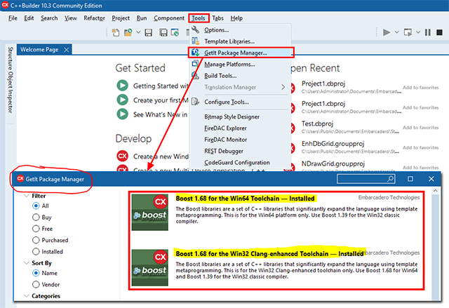
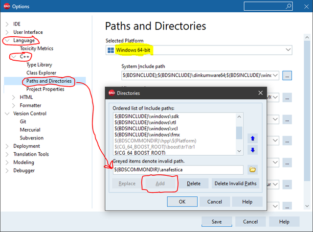
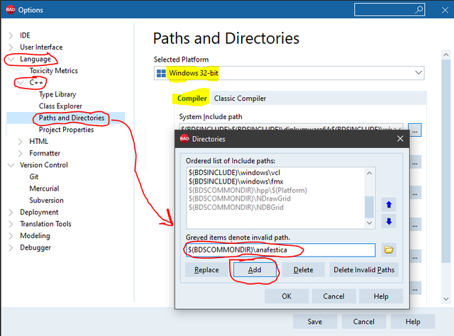

# Anafestica
An header-only library for the persistence of application settings in the Windows Registry or in other "media" (JSON, XML, etc.)

## Rationale

This library easily allows settings' persistence to applications (FMX, VCL, and more) with very few changes to the pre-existing codebase. For example, it's possible to save the position, the size, and the state of the GUI forms, along with other custom attributes, in a very simple fashion, i.e. just adding very few lines of code.

The idea behind the library is to have a hierarchical heterogeneous container that resembles the Windows registry but lying in application memory. Suppose to have a Registry Key as a base key: this is intended as the "root image" of the heterogeneous container. When the application starts, the in-memory container trying to load the data contained in the aforesaid Windows Registry base key. If the Registry key exists, the content (the base key and all the subkeys) is loaded in memory. If the Registry key doesn't exist, the in-memory container is built with the attributes default values. When the application runs, it can read or write these keys (and related values), but all the changes remain confined to the application's memory. When the application ends, the container's content is written back in the storage medium and with its intended format. If the application crashes before writing data back,  the data in the storage medium remain unchanged. Note the container can also use different medium storage than the Windows Registry, e.g. it can use the filesystem or the network then use formats like JSON or XML.

The library is mainly made by two parts: a container part (which is generalized) and a serialization part. From the application point of view, it allows having a coherent interface and permits to store persistent data on different storage mediums or formats. 

Windows application's persistent data are usually stored in the Registry, respecting the conventions regarding the nature of the application itself (nature intended as a normal application or, e.g., a service application or other application type). Changing the serialization part via a template parameter (i.e it's a Policy), it's possible to specify both the data format and the storage medium. It is also possible to have several storage mediums and formats in the same application. Each serialization format is associated with a specific container, by the mean that each container is bounded to a serializer that can have, in turn, a specific format and storage medium.

The current library version includes serializers for Windows Registry, JSON and XML files.

## Getting Started

The library itself is made only by header files and therefore it is easy to use and to include in the codebase and does not require additional compilation steps: just needs to include the necessary header files into the project. Can also be used in contexts other than GUI applications, but its real advantages are seen in the writing of the latter, where it certainly simplifies the management of the persistence of application attributes such as the position, size, and state of the forms, up to the settings of the whole application.

### Prerequisites / Dependecies

Anafestica uses "boost::variant" instead of "std::variant" due to an unresolved bug in the standard C++Builder's library, which prevents direct assignment of values to std::variant (See (https://quality.embarcadero.com/browse/RSP-27418) on Embarcadero Quality Portal).

The "boost::variant" class is contained in one of the boost project libraries. So it's necessary to obtain "boost libraries" first. Luckily, it's possible to use the IDE's GetIt tool to install seamlessly the boost libraries (e.g. 1.68.0 for Rad Studio 10.3 or 1.70.0 for Rad Studio 10.4).



Please, note that only _clang-based_ compilers are supported by this library (i.e bcc32c and bcc64).

### Installing

Installation is not really necessary. Simply add the header files that make up the library to your project. But if you embed the same files multiple times for each new project, there will be unwanted proliferation which can be confusing if you use different revisions over time. So it is often preferable to "install" the library and refer to it with the environment variables of the development system.

To install the library, clone the repository to $(BDSCOMMONDIR) which, normally, is %public%\Documents\Embarcadero\Studio\XX.X, where XX.X corresponds to the version of RAD Studio of interest. For example, for RAD Studio 10.4, $(BDSCOMMONDIR) corresponds to %public%\Documents\Embarcadero\Studio\XX.X which, in turn, is usually C:\Users\Public\Documents\Embarcadero\Studio\21.0.

```
C:\Users\Public\Documents\Embarcadero\Studio\21.0>git clone https://github.com/gcardi/Anafestica.git
```

To complete the installation, the last important step is to add the references to this library in the include path(s) of the development system. Using the IDE menu _Tool -> Options_, add the $(BDSCOMMONDIR)\Anafestica path to both bcc32c and bcc64 settings:





That's all. 

## More

Try a [Quick Tour](QUICK_TOUR.md) in Anafestica.

