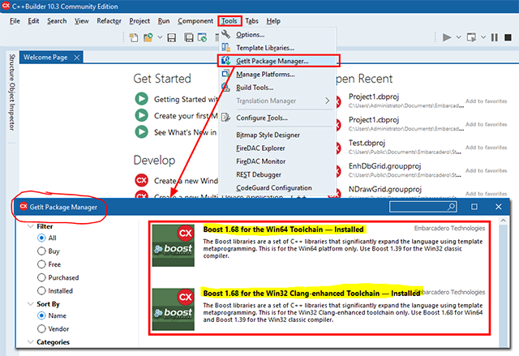
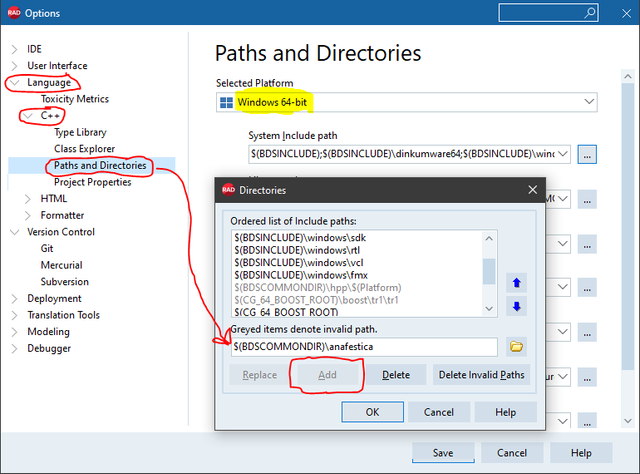
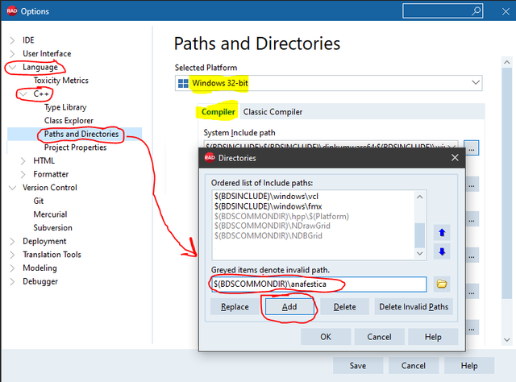

# Anafestica
A header-only library for the persistence of application settings in the Windows Registry or other media (JSON, XML, etc.)

## Rationale

This library enables easy persistence of application settings for FMX, VCL, and other applications with minimal changes to existing code. For example, you can save the position, size, and state of GUI forms along with other custom attributes by adding just a few lines of code.

The core idea is to provide a hierarchical, heterogeneous container that resembles the Windows Registry but resides in application memory. Consider a Registry key as the base key: this serves as the "root image" of the heterogeneous container. When the application starts, the in-memory container tries to load data from the specified Windows Registry base key. If the Registry key exists, its content (including the base key and all subkeys) is loaded into memory. If the Registry key doesn't exist, the in-memory container is initialized with default attribute values. During application execution, you can read from or write to these keys and their values, but all changes remain confined to the application's memory. When the application terminates, the container's content is written back to the storage medium in its intended format. If the application crashes before writing data back, the data in the storage medium remains unchanged. Note that the container can also use different storage media than the Windows Registry, such as the filesystem or network, using formats like JSON or XML.

The library consists of two main parts: a container part (which is generalized) and a serialization part. From the application's point of view, it provides a consistent interface and enables storing persistent data across different storage media and formats.

Windows applications' persistent data is typically stored in the Registry, following conventions based on the application's nature (whether it's a normal application, service, or other application type). By changing the serialization part via a template parameter (i.e., it's a Policy), you can specify both the data format and storage medium. It is also possible to use several different storage media and formats within the same application. Each serialization format is associated with a specific container, meaning each container is bound to a serializer that can have its own format and storage medium.

The current library version includes serializers for Windows Registry, JSON, and XML files.

## Getting Started

The library consists only of header files, making it easy to use and integrate into your codebase without requiring additional compilation steps; you just need to include the necessary header files in your project. It can also be used in contexts other than GUI applications, but its real advantages are evident when developing GUI applications, where it greatly simplifies the management of persistent attributes such as form position, size, and state, as well as application-wide settings.

## Documentation

Try a [Quick Tour](QUICK_TOUR.md) in Anafestica.

For detailed API documentation, see [Library Documentation](LIBRARY_DOCUMENTATION.md).

### Prerequisites / Dependencies

Anafestica uses `boost::variant` instead of `std::variant` due to an unresolved bug in C++Builder's standard library that prevents direct assignment of values to `std::variant` (see https://quality.embarcadero.com/browse/RSP-27418 on the Embarcadero Quality Portal). However, the `bcc64x` compiler supports `std::variant` properly, so you can optionally use standard library variants by defining `ANAFESTICA_USE_STD_VARIANT` as a project-wide preprocessor definition when using this compiler.

The `boost::variant` class is part of the Boost project libraries. You must first obtain the Boost libraries. Fortunately, you can use the IDE's GetIt tool to install them seamlessly (e.g., version 1.68.0 for RAD Studio 10.3 or 1.70.0 for RAD Studio 10.4).



Please note that only Clang-based compilers are supported by this library (i.e., bcc32c, bcc64, and bcc64x).

### Installing

Installation is not strictly necessary. Simply add the header files that comprise the library to your project. However, if you include the same files in multiple projects, it can lead to unwanted duplication, which can be confusing if you use different revisions over time. Therefore, it is often preferable to "install" the library and reference it using the development system's environment variables.

To install the library, clone the repository to `$(BDSCOMMONDIR)`, which is normally `%PUBLIC%\Documents\Embarcadero\Studio\XX.X`, where `XX.X` corresponds to the version of RAD Studio you are using. For example, for RAD Studio 10.4, `$(BDSCOMMONDIR)` corresponds to `%PUBLIC%\Documents\Embarcadero\Studio\21.0`.

```
C:\Users\Public\Documents\Embarcadero\Studio\21.0>git clone https://github.com/gcardi/Anafestica.git
```

To complete the installation, add references to this library in the development system's include paths. Using the IDE menu **Tools → Options**, add the `$(BDSCOMMONDIR)\Anafestica` path to both bcc32c, bcc64, and bcc64x settings:





That's all.

